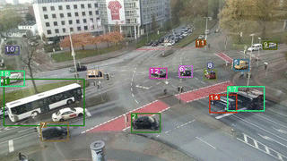
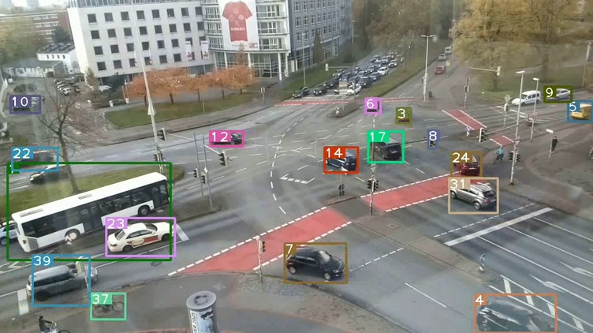
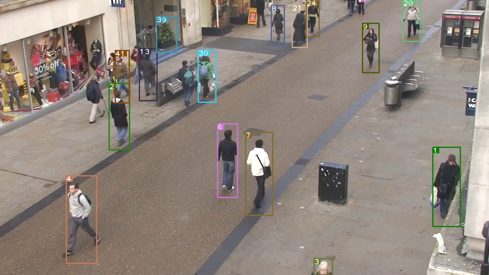

# Deep Sort with PyTorch(yolo-all)




## Introduction
This is an implement of MOT tracking algorithm deep sort. This project originates from [deep_sort_pytorch](https://github.com/ZQPei/deep_sort_pytorch). On the above projects, this project add the existing yolo detection model algorithm (YOLOv3, YOLOV4, YOLOV4Scaled, YOLOV5, YOLOV6, YOLOV7).

# Model

## Object detection

- MMDet
- YOLOv3
- YOLOV4
- YOLOV4Scaled
- YOLOV5
- YOLOV6
- YOLOV7


## ReID 

- deepsort-reid
- fast-reid


## Dependencies

- python 3 (python2 not sure)
- numpy
- scipy
- opencv-python
- sklearn
- torch >= 0.4
- torchvision >= 0.1
- pillow
- vizer
- edict

## Quick Start
0. Check all dependencies installed
```bash
pip install -r requirements.txt
```
for user in china, you can specify pypi source to accelerate install like:
```bash
pip install -r requirements.txt -i https://pypi.tuna.tsinghua.edu.cn/simple
```

1. Clone this repository
```
git clone https://github.com/xuarehere/yolovx_deepsort_pytorch.git
```

2. Download YOLOv3 parameters
```
cd detector/YOLOv3/weight/
wget https://pjreddie.com/media/files/yolov3.weights
wget https://pjreddie.com/media/files/yolov3-tiny.weights
cd ../../../
```

3. Download deepsort parameters ckpt.t7
```
cd deep_sort/deep/checkpoint
# download ckpt.t7 from
https://drive.google.com/drive/folders/1xhG0kRH1EX5B9_Iz8gQJb7UNnn_riXi6 to this folder
cd ../../../
```

4. Compile nms module
```bash
cd detector/YOLOv3/nms
sh build.sh
cd ../../..
```

Notice:
If compiling failed, the simplist way is to **Upgrade your pytorch >= 1.1 and torchvision >= 0.3" and you can avoid the troublesome compiling problems which are most likely caused by either `gcc version too low` or `libraries missing`.

5. (Optional) Prepare third party submodules

[fast-reid](https://github.com/JDAI-CV/fast-reid)

This library supports bagtricks, AGW and other mainstream ReID methods through providing an fast-reid adapter.

to prepare our bundled fast-reid, then follow instructions in its README to install it.

Please refer to `configs/fastreid.yaml` for a sample of using fast-reid. See [Model Zoo](https://github.com/JDAI-CV/fast-reid/blob/master/docs/MODEL_ZOO.md) for available methods and trained models.

[MMDetection](https://github.com/open-mmlab/mmdetection)

This library supports Faster R-CNN and other mainstream detection methods through providing an MMDetection adapter.

to prepare our bundled MMDetection, then follow instructions in its README to install it.

Please refer to `configs/mmdet.yaml` for a sample of using MMDetection. See [Model Zoo](https://github.com/open-mmlab/mmdetection/blob/master/docs/model_zoo.md) for available methods and trained models.

Run

```
git submodule update --init --recursive
```


6. Run demo
```
usage: deepsort.py [-h]
                   [--fastreid]
                   [--config_fastreid CONFIG_FASTREID]
                   [--mmdet]
                   [--config_mmdetection CONFIG_MMDETECTION]
                   [--config_detection CONFIG_DETECTION]
                   [--config_deepsort CONFIG_DEEPSORT] [--display]
                   [--frame_interval FRAME_INTERVAL]
                   [--display_width DISPLAY_WIDTH]
                   [--display_height DISPLAY_HEIGHT] [--save_path SAVE_PATH]
                   [--cpu] [--camera CAM]
                   VIDEO_PATH         

# yolov3 + deepsort
python deepsort.py [VIDEO_PATH]

# yolov3_tiny + deepsort
python deepsort.py [VIDEO_PATH] --config_detection ./configs/yolov3_tiny.yaml

# yolov3 + deepsort on webcam
python3 deepsort.py /dev/video0 --camera 0

# yolov3_tiny + deepsort on webcam
python3 deepsort.py /dev/video0 --config_detection ./configs/yolov3_tiny.yaml --camera 0

# fast-reid + deepsort
python deepsort.py [VIDEO_PATH] --fastreid [--config_fastreid ./configs/fastreid.yaml]

# MMDetection + deepsort
python deepsort.py [VIDEO_PATH] --mmdet [--config_mmdetection ./configs/mmdet.yaml]


# yolov4 + deepsort on video
python3 deepsort.py ./001.avi --save_path ./output/yolov4/001 --config_detection ./configs/yolov4.yaml --detect_model yolov4


# yolov4Scaled + deepsort on video
python3 deepsort.py ./001.avi --save_path ./output/yolov4Scaled/001 --config_detection ./configs/yolov4Scaled.yaml --detect_model yolov4Scaled

# yolov5 + deepsort on video
python3 deepsort.py ./001.avi --save_path ./output/yolov5/001 --config_detection ./configs/yolov5.yaml --detect_model yolov5

# yolov6 + deepsort on video
python3 deepsort.py ./001.avi --save_path ./output/yolov6/001 --config_detection ./configs/yolov6.yaml --detect_model yolov6

# yolov7 + deepsort on video
python3 deepsort.py ./001.avi --save_path ./output/yolov7/001 --config_detection ./configs/yolov7.yaml --detect_model yolov7


```
Use `--display` to enable display.  
Results will be saved to `./output/results.avi` and `./output/results.txt`.

All files above can also be accessed from BaiduDisk!  
linker：[BaiduDisk](https://pan.baidu.com/s/1YJ1iPpdFTlUyLFoonYvozg)
passwd：fbuw

## Training the RE-ID model
The original model used in paper is in original_model.py, and its parameter here [original_ckpt.t7](https://drive.google.com/drive/folders/1xhG0kRH1EX5B9_Iz8gQJb7UNnn_riXi6).  

To train the model, first you need download [Market1501](http://www.liangzheng.com.cn/Project/project_reid.html) dataset or [Mars](http://www.liangzheng.com.cn/Project/project_mars.html) dataset.  

Then you can try [train.py](deep_sort/deep/train.py) to train your own parameter and evaluate it using [test.py](deep_sort/deep/test.py) and [evaluate.py](deep_sort/deep/evalute.py).


## Demo videos and images








## References
-  [nwojke/deep_sort](https://github.com/nwojke/deep_sort)
- [Joseph Redmon/yolov3](https://pjreddie.com/darknet/yolo/)
- [ZQPei/deep_sort_pytorch](https://github.com/ZQPei/deep_sort_pytorch)
- [WongKinYiu/PyTorch_YOLOv4](https://github.com/WongKinYiu/PyTorch_YOLOv4)
- [WongKinYiu/ScaledYOLOv4](https://github.com/WongKinYiu/ScaledYOLOv4)
- [ultralytics/yolov5](https://github.com/ultralytics/yolov5)
- [meituan/YOLOv6](https://github.com/meituan/YOLOv6)
- [WongKinYiu/yolov7](https://github.com/WongKinYiu/yolov7)


